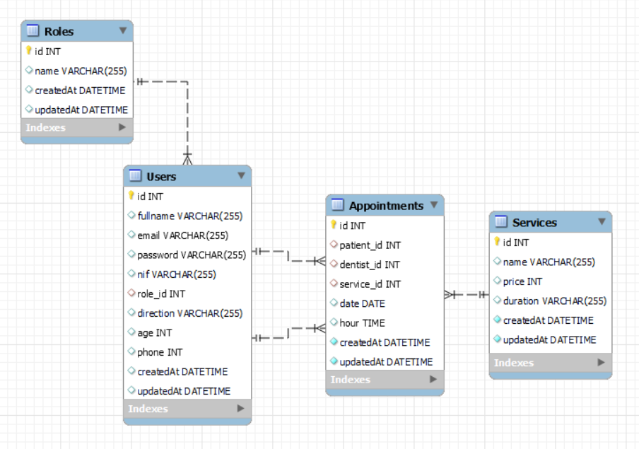

## Backend Clínica Dental

### Objetivo
Este proyecto requería una base de datos relacional de una clínica dental utilizando Express y Sequelize.

### Sobre el proyecto
En el backend de la clínica dental, gestionamos dos tipos de usuarios: usuarios/pacientes y administradores/dentistas. Por razones de seguridad, todos los nuevos registros se asignarán inicialmente al rol de paciente. Una vez registrados, los pacientes podrán crear, modificar y visualizar sus propias citas, así como ver y actualizar su perfil.

Por otro lado, los administradores/dentistas tendrán acceso completo para ver todos los pacientes y citas registradas. Además, se ha añadido paginación para 6 elementos en los endpoints de usuarios y citas, permitiendo una navegación más eficiente a través de los datos. La paginación incluye filtrado por criterios de búsqueda y devuelve información sobre el total de citas, pacientes y servicios en cada página.

Adicionalmente, se ha implementado una validación al crear y actualizar una cita, asegurando que los doctores estén disponibles en la fecha y hora seleccionadas para evitar conflictos de horarios. También se han creado validaciones para los inputs del usuario, asegurando que cumplan con los formatos requeridos y sean válidos.

### Tecnologías utilizadas:
<div align="center">
        <a href="https://www.sequelize.org/">
        
    </a>
        <a href="https://www.mysql.com/">
        
    </a>
        <a href="https://expressjs.com/">
        
    </a>
    <a href="https://nextjs.org/">
        
    </a>
    <a href="https://developer.mozilla.org/es/docs/Web/JavaScript">
        
    </a>
    <a href="https://jwt.io/">
        
    </a>
    <a href="https://www.postman.com/">
        
    </a>
    <a href="https://www.docker.com/">
        
    </a>
 </div>


### Diagrama BD


## Instalación en local
1. Clonamos el repositorio `$git clone 'url-repository'`
2. Instalamos las dependencias ` $ npm install `
3. Conectamos nuestro repositorio con la base de datos ` $ npx sequelize db:create `
4. Ejecutamos las migraciones ` $ npx sequelize db:migrate `
5. Ejecutamos los seeders ` $ npx sequelize db:seed:all ` 
6. Conectamos el servidor` $ npm run dev ` 

### Endpoints
<details>
<summary>Endpoints</summary>

- AUTH
    - REGISTER

            POST http://localhost:4000/auth/register
        body:
        ``` js
            {
                "name": "Usuario",
                "lastname": "Apellido",
                "email": "usuario@apellido.com",
                "dni": "12341567L",
                "address": "Calle inventada 1",
                "phone": "600000000",
                "password": "12345678",
            }
        ```

    - LOGIN

            POST http://localhost:4000/auth/login
        body:
        ``` js
            {
                "email":"roma@roma.com",
                "password": "123456"
            }
        ```

- APPOINTMENT
    - CREATE AN APPOINTMENT 

            POST http://localhost:4000/appointment/createAppointment
        body:
        ``` js
            {
                "patient_id": "3",
                "dentist_id": "1",
                "service_id": "3",
                "date": "2023-03-02",
                "hour": "14:35:00"
            }
        ```

    - GET ALL APPOINTMENTS & SEARCH (ADMIN)

            GET http://localhost:4000/appointment/searchAppointments
        response:
        ```js
        {
            "message": "Appointments retrieved",
            "pagination": {
                "totalItems": 18,
                "currentPage": 2,
                "totalPages": 3,
                "perPage": 6
            },
            "data": [
                {
                    "id": 14,
                    "patient_id": 5,
                    "dentist_id": 2,
                    "service_id": 2,
                    "date": "2024-04-16",
                    "hour": "09:30:00"
                },
                ...
                {
                    "id": 21,
                    "patient_id": 7,
                    "dentist_id": 2,
                    "service_id": 4,
                    "date": "2024-06-25",
                    "hour": "10:30:00"
                }
            ],
            "success": true
        }
        ```

    - GET APPOINTMENT BY ID

            GET http://localhost:4000/appointment/getAppointmentById/7
        response:
        ```js
        {
            "message": "Appointment retrieved successfully",
            "data": {
                "id": 7,
                "patient_id": 2,
                "dentist_id": 2,
                "service_id": 1,
                "date": "2024-04-16",
                "hour": "14:30:00",
                "createdAt": "2024-04-02T16:13:47.000Z",
                "updatedAt": "2024-06-20T21:25:01.000Z",
                "patient": {
                    "name": "Rominda",
                    "lastname": "Rominda"
                },
                "dentist": {
                    "name": "Rominda",
                    "lastname": "Rominda"
                },
                "service": {
                    "name": "Consulta",
                    "price": null
                }
            },
            "success": true
        }
        ```

    - UPDATE APPOINTMENT

            PUT http://localhost:4000/appointment/update/1
        body:
        ``` js
            {
                "patient_id": "4",
                "dentist_id": "3",
                "service_id": "5",
                "date": "2023-03-02",
                "hour": "14:35:00"
            }
        ```

    - GET ALL MY APPOINTMENTS & SEARCH (PATIENT)

            PUT http://localhost:4000/appointment/searchAppointments
        response:
        ```js
        {
            "message": "Appointments retrieved",
            "pagination": {
                "totalItems": 3,
                "currentPage": 1,
                "totalPages": 1,
                "perPage": 6
            },
            "data": [
                {
                    "id": 25,
                    "patient_id": 21,
                    "dentist_id": 3,
                    "service_id": 3,
                    "date": "2024-06-23",
                    "hour": "14:30:00"
                },
                ...
                {
                    "id": 27,
                    "patient_id": 21,
                    "dentist_id": 2,
                    "service_id": 5,
                    "date": "2024-06-24",
                    "hour": "14:30:00"
                }
            ],
            "success": true
        }
        ```

    - GET HOURS

            GET http://localhost:4000/appointment/getHours
        response:
        ```js
        {
            "success": true,
            "message": "Hours retrieved",
            "data": [
                {
                    "id": 1,
                    "hour": "09:00:00"
                },
                ...
                {
                    "id": 6,
                    "hour": "16:00:00"
                }
            ]
        }
        ```


- USERS
    - GET ALL USERS (ADMIN)

            GET http://localhost:4000/user/getAllUsers
        response:
        ```js
        {
            "message": "Users retrieved",
            "pagination": {
                "totalItems": 13,
                "currentPage": 1,
                "totalPages": 3,
                "perPage": 6
            },
            "data": [
                {
                    "id": 1,
                    "name": "Rominda",
                    "lastname": "Rominda",
                    "email": "admin@dentist.com",
                    "dni": "21645613Z",
                    "role_id": 2
                },
                ...
                {
                    "id": 7,
                    "name": "Francisco",
                    "lastname": "Xisco",
                    "email": "hola@hola.com",
                    "dni": "1234567X",
                    "role_id": 3
                }
            ],
            "success": true
        }
        ```

    - GET USER DETAIL (ADMIN)

            GET http://localhost:4000/user/getUserDetails/3
        response:
        ```js
        {
            "message": "User details retrieved successfully for admin",
            "data": {
                "id": 3,
                "name": "Lorena",
                "lastname": "García",
                "email": "lore@lore.com",
                "dni": "24645143Y",
                "address": "Calle server 26",
                "phone": 666573883,
                "role_id": 2,
                "createdAt": "2024-02-25T19:47:22.000Z",
                "updatedAt": "2024-06-13T18:44:21.000Z"
            },
            "success": true
        }
        ```

    - GET MY PROFILE

            GET http://localhost:4000/user/getUser
        response:
        ```js
        {
            "message": "User retrieved successfully",
            "data": {
                "id": 21,
                "name": "Usuario",
                "lastname": "Usuario",
                "email": "user@user.com",
                "dni": "12354567L",
                "address": "Calle inventada",
                "phone": 600000000,
                "password":"$2b$08$c25oyvZZohhw3OuwsmkT4cEruKIBqbjAmd9XzzLhfWS"
            },
            "success": true
        }
        ```

    - UPDATE MY PROFILE

            PUT localhost:4000/user/update
        body:
        ```js
            {
                "name": "NuevoNombre",
                "lastname": "NuevoApellido",
                "email": "nuevo@correo.com",
                "dni": "12345678X",
                "address": "Nueva dirección 123",
                "phone": "600123456",
                "password": "nuevaContraseña"
            }
        ```

    - GET ALL DENTIST

            GET http://localhost:4000/user/getAllDentists
        response:
        ```js
        {
            "success": true,
            "message": "Dentists retrieved",
            "data": [
                {
                    "id": 2,
                    "name": "Maria",
                    "lastname": "Rominda"
                },
                {
                    "id": 3,
                    "name": "Lorena",
                    "lastname": "García"
                }
            ]
        }
        ```

- SERVICE
    - GET ALL SERVICES 

            GET http://localhost:4000/service/getAll
        response:
        ```js
        {
            "message": "All services retrieved",
            "data": [
                {
                    "id": 1,
                    "name": "Consulta",
                    "price": null
                },
                {
                    "id": 2,
                    "name": "Limpieza dental",
                    "price": 40
                },
                ...
                {
                    "id": 7,
                    "name": "Tratamiento de conducto",
                    "price": 50
                }
            ],
            "success": true
        }
        ```
</details>

### Agradecimientos:

Agradezco a mis profesores y compañeros el tiempo dedicado a este proyecto.

### Autor:

Jorge Luis Martin Lorenzo.
