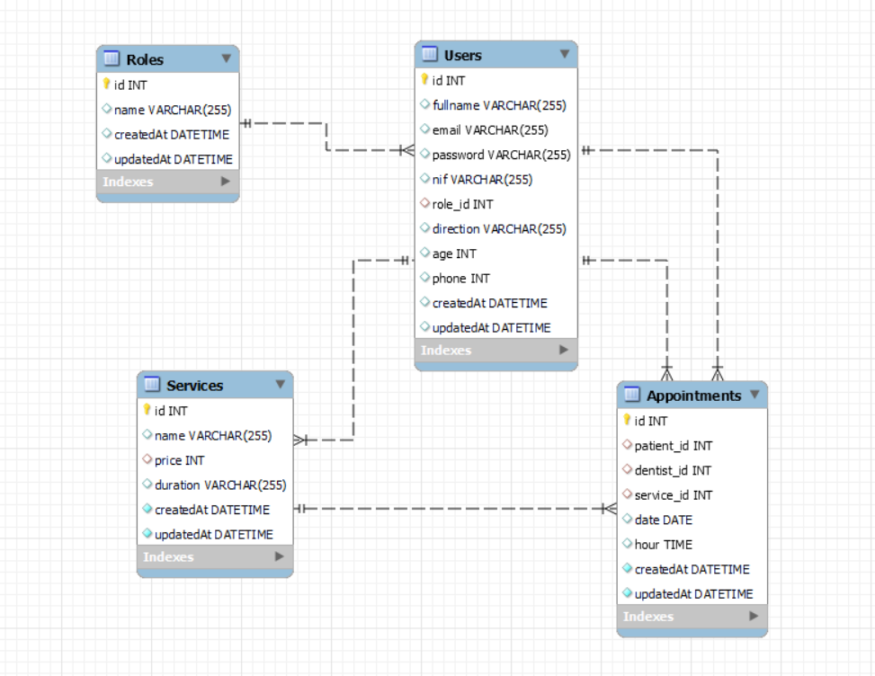

## clinicadental API project

### Sobre el proyecto
Este proyecto requería una API funcional conectada a una base de datos de una clínica dental con al menos una relación de uno a muchos y una relación de muchos a muchos.  

### Deploy 🚀

    <a href="https://www.google.com"><strong>Url a producción </strong></a>🚀🚀🚀

### Stack
Tecnologías utilizadas:

 

### Diagrama BD

### Uso de la API

Ingresa y podrás hacer uso de la API.

### Agradecimientos:

Agradezco a mis compañeros el tiempo dedicado a este proyecto.

### Autor:
Jorge Luis Martin Lorenzo.