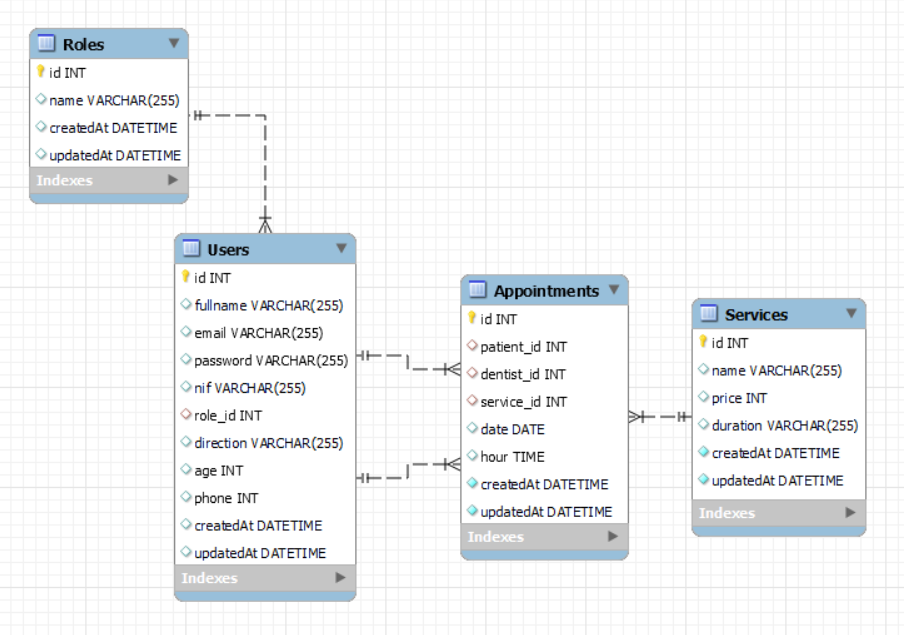

## Backend Clínica Dental

### Objetivo
Este proyecto requería una base de datos relacional de una clínica dental utilizando Express y Sequelize.

### Sobre el proyecto
Basandonos en el Backend para una Clínica Dental, disponemos de usuarios pacientes y admin/dentistas. Por cuestiones de seguridad, todos los usuarios que se registren tendrán el rol de pacientes. Un vez registrados se tendrá la posibilidad de crear, modificar y borrar citas propias, también se podrá ver, modificar o borrar el perfil.

Como admin/dentistas, se tendrá la posibilidad de ver todos los pacientes registrados y tambien todas las citas, mientras que los pacientes podrán ver su historial de citas junto con el precio y el id del tratamiento asociado.

### Tecnologías utilizadas:
<div align="center">
        <a href="https://www.sequelize.org/">
        
    </a>
        <a href="https://www.mysql.com/">
        
    </a>
        <a href="https://expressjs.com/">
        
    </a>
    <a href="https://nextjs.org/">
        
    </a>
    <a href="https://developer.mozilla.org/es/docs/Web/JavaScript">
        
    </a>
    <a href="https://jwt.io/">
        
    </a>
    <a href="https://www.postman.com/">
        
    </a>
    <a href="https://www.docker.com/">
        
    </a>
 </div>


### Diagrama BD


## Instalación en local
1. Clonamos el repositorio `$git clone 'url-repository'`
2. Instalamos las dependencias ` $ npm install `
3. Conectamos nuestro repositorio con la base de datos ` $ npx sequelize db:create `
4. Ejecutamos las migraciones ` $ npx sequelize db:migrate `
5. Ejecutamos los seeders ` $ npx sequelize db:seed:all ` 
6. Conectamos el servidor` $ npm run dev ` 

### Endpoints
<details>
<summary>Endpoints</summary>

- AUTH
    - REGISTER

            POST http://localhost:4000/auth/register
        body:
        ``` js
            {
                "fullname":"Maria",
                "email":"hala@maria.com",
                "password": "12345678",
                "nif": "12345648Y",
                "direction": "C/ no existe 23",
                "age": "34",
                "phone": "655613298"
            }
        ```

    - LOGIN

            POST http://localhost:4000/auth/login
        body:
        ``` js
            {
                "email":"roma@roma.com",
                "password": "123456"
            }
        ```

- ADMIN
    - GET ALL APPOINTMENTS

            GET http://localhost:4000/appointment/getAll

    - GET ALL USERS

            GET http://localhost:4000/user/getAll

- PACIENTES/USUARIOS

    - GET ALL SERVICES 

            GET http://localhost:4000/service/getAll

    - CREATE AN APPOINTMENT 

            POST http://localhost:4000/appointment/create
        ``` js
            {
                "patient_id": "3",
                "dentist_id": "1",
                "service_id": "3",
                "date": "2023-03-02",
                "hour": "14:35:00"
            }
        ```
    - GET ALL MY APPOINTMENTS (AS USER)

            PUT http://localhost:4000/user/getAll/4

    - UPDATE APPOINTMENT (AS PATIENT)

            PUT http://localhost:4000/appointment/update/1
        ``` js
            {
                "patient_id": "4",
                "dentist_id": "3",
                "service_id": "5",
                "date": "2023-03-02",
                "hour": "14:35:00"
            }
        ```

    - DELETE APPOINTMENT (ONLY YOURS)

            DELETE http://localhost:4000/appointment/delete/6

    - GET MY PROFILE

            GET http://localhost:4000/user/getUser/5

    - UPDATE MY PROFILE

            PUT localhost:4000/user/update/13
        ``` js
            {
                "patient_id": "4",
                "dentist_id": "3",
                "service_id": "5",
                "date": "2023-03-02",
                "hour": "14:35:00"
            }
        ```
            
    - DELETE MY PROFILE
    
            DELETE http://localhost:4000/user/delete/5
</details>

### Uso de la API

Ingresa y podrás hacer uso de la API.

[](https://www.postman.com/jorgemctin/workspace/dental-clinic/request/27847989-cede5d46-5868-4252-a484-e325b2328a93)

### Agradecimientos:

Agradezco a mis profesores y compañeros el tiempo dedicado a este proyecto.

### Autor:
Jorge Luis Martin Lorenzo.
